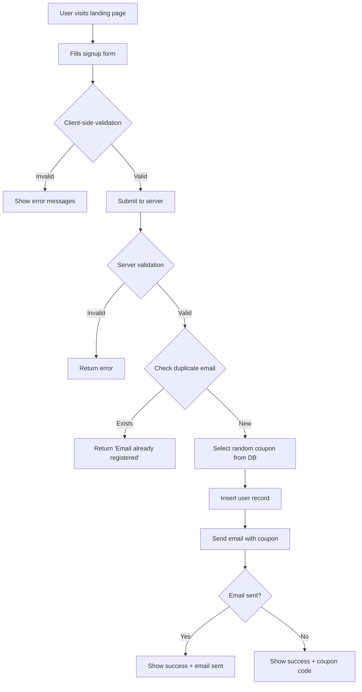

# 🚀 TaskMan Landing Page

> A modern, animated landing page with full-stack functionality built for a task management platform. Features smooth animations, responsive design, and complete email integration.

[](https://developer.mozilla.org/en-US/docs/Web/HTML)
[](https://developer.mozilla.org/en-US/docs/Web/CSS)
[](https://developer.mozilla.org/en-US/docs/Web/JavaScript)
[](https://www.php.net/)
[](https://www.mysql.com/)


## ✨ Features

### 🎨 Frontend
- ✅ **Custom CSS Animations** - Smooth, GPU-accelerated animations without frameworks
- ✅ **Fully Responsive** - Mobile-first design with hamburger menu
- ✅ **Intersection Observer** - Scroll-triggered animations for better performance
- ✅ **Modern CSS** - CSS Grid, Flexbox, Custom Properties
- ✅ **No Dependencies** - Pure vanilla JavaScript, no jQuery or frameworks

### ⚙️ Backend
- ✅ **PHP Form Processing** - Server-side validation and sanitization
- ✅ **MySQL Database** - Structured data storage with prepared statements
- ✅ **Email Integration** - PHPMailer for reliable email delivery
- ✅ **Security** - SQL injection prevention, XSS protection, duplicate prevention
- ✅ **Random Coupon System** - Automated coupon distribution from database pool

### 🎯 Animations
- Hero section background shapes fan-out effect
- Illustration cards burst animation with infinite floating
- Benefits section staggered fade-in reveal
- Why section line draw and circle grow effects
- Signup section fade-in with triangle slide animation
- Smooth scroll navigation
- Mobile menu slide-in with overlay


## 📁 Project Structure

```
landing-page/
│
├── 📄 index.html                    # Main landing page
├── 📄 process_signup.php            # Form handler and email sender
│
├── 📂 css/
│   └── style.css                    # Custom styles (no frameworks)
│
├── 📂 js/
│   └── script.js                    # Animations & form validation
│
├── 📂 images/
│   ├── 1. Hero/                     # Hero section assets
│   ├── 2. Logos/                    # Company logos
│   ├── 3. Benefits/                 # Benefit icons
│   ├── 4. Why/                      # Why section illustrations
│   └── 5. Signup/                   # Signup section assets
│
├── 📂 includes/
│   └── config.php                   # Database & email configuration
│
├── 📂 database/
│   └── schema.sql                   # Database schema & sample data
│
├── 📂 PHPMailer/                    # Email library
│   ├── Exception.php
│   ├── PHPMailer.php
│   └── SMTP.php
│
├── 📄 README.md                     # This file
└── 📄 .htaccess                     # Apache configuration (if needed)
```

---

## 🚀 Quick Start

### Prerequisites

Before you begin, ensure you have the following installed:

- **PHP** 7.4 or higher ([Download](https://www.php.net/downloads))
- **MySQL** or **MariaDB** ([Download](https://dev.mysql.com/downloads/))
- **Apache/Nginx** web server (or use [XAMPP](https://www.apachefriends.org/))

### Installation

#### 1️⃣ Clone the Repository

```bash
git clone [](https://github.com/RAJJAISWALL/landing-page)
cd taskman-landing-page
```

#### 2️⃣ Database Setup

**Option A: Using phpMyAdmin**
1. Open phpMyAdmin in your browser
2. Create a new database: `landing_page_db`
3. Select the database
4. Go to **SQL** tab
5. Copy and paste the contents of `database/schema.sql`
6. Click **Go** to execute

**Option B: Using MySQL Command Line**
```bash
mysql -u root -p
CREATE DATABASE landing_page_db;
USE landing_page_db;
SOURCE database/schema.sql;
EXIT;
```

#### 3️⃣ Configure Database Connection

Edit `includes/config.php`:

```php
// Database Configuration
define('DB_HOST', 'localhost');        // Your database host
define('DB_USER', 'root');             // Your MySQL username
define('DB_PASS', 'your_password');    // Your MySQL password
define('DB_NAME', 'landing_page_db');  // Database name
```

#### 4️⃣ Configure Email (Optional but Recommended)

**For Gmail:**

1. Enable 2-Factor Authentication on your Google account
2. Generate an App Password: [Google App Passwords](https://myaccount.google.com/apppasswords)
3. Update `includes/config.php`:

```php
// Email Configuration
define('SMTP_HOST', 'smtp.gmail.com');
define('SMTP_PORT', 587);
define('SMTP_USER', 'your-email@gmail.com');
define('SMTP_PASS', 'your-app-password');      // 16-character app password
define('FROM_EMAIL', 'your-email@gmail.com');
define('FROM_NAME', 'TaskMan');
```


#### 5️⃣ Deploy the Application

**For XAMPP:**
```bash
# Copy project to XAMPP htdocs
cp -r landing-page /xampp/htdocs/

# Access at: http://localhost/landing-page/
```


## 🎯 Usage

### User Signup Flow



### Form Validation Rules

| Field | Rules | Example |
|-------|-------|---------|
| **Name** | Required, Min 2 characters | Tester |
| **Email** | Required, Valid email format | testere@example.com |
| **Phone** | Optional, 10-20 characters, numbers/symbols allowed

### Adding New Coupons

Connect to your database and run:

```sql
INSERT INTO coupons (coupon_code, discount_percentage, description, is_active) 
VALUES ('SUMMER2024', 30, 'Summer special discount', TRUE);
```

Or via phpMyAdmin:
1. Select `landing_page_db` database
2. Click on `coupons` table
3. Click **Insert**
4. Fill in the form and click **Go**

---


## 🔒 Security Features

- ✅ **SQL Injection Prevention** - Prepared statements with parameterized queries
- ✅ **XSS Protection** - Input sanitization using `trim()` and `filter_var()`
- ✅ **Email Validation** - Server-side validation with `FILTER_VALIDATE_EMAIL`
- ✅ **Duplicate Prevention** - UNIQUE constraint on email column
- ✅ **IP Logging** - Track signup IP addresses for abuse detection
- ⚠️ **Environment Variables** - **IMPORTANT:** Never commit sensitive credentials to Git


## 🐛 Troubleshooting

### Database Connection Issues

**Error:** `Connection failed: Access denied`
```bash
# Solution: Check credentials in config.php
# Verify MySQL is running
sudo service mysql status
```

**Error:** `Unknown database 'landing_page_db'`
```bash
# Solution: Create the database
mysql -u root -p
CREATE DATABASE landing_page_db;
```

### Email Not Sending

**Issue:** Emails not arriving

1. **Check SMTP credentials** in `config.php`
2. **Verify Gmail App Password** (not regular password)
3. **Check spam folder**
4. **Enable less secure apps** (for testing only)
5. **Check PHP error logs:**
```bash
tail -f /var/log/apache2/error.log
```


## 📚 Documentation

### Database Schema

#### **coupons** table
```sql
CREATE TABLE coupons (
    id INT AUTO_INCREMENT PRIMARY KEY,
    coupon_code VARCHAR(50) UNIQUE NOT NULL,
    discount_percentage INT NOT NULL,
    description VARCHAR(255),
    is_active BOOLEAN DEFAULT TRUE,
    created_at TIMESTAMP DEFAULT CURRENT_TIMESTAMP
);
```

#### **signups** table
```sql
CREATE TABLE signups (
    id INT AUTO_INCREMENT PRIMARY KEY,
    name VARCHAR(100) NOT NULL,
    email VARCHAR(100) UNIQUE NOT NULL,
    phone VARCHAR(20),
    coupon_sent VARCHAR(50),
    signup_date TIMESTAMP DEFAULT CURRENT_TIMESTAMP,
    ip_address VARCHAR(45)
);
```

### API Endpoints

| Endpoint | Method | Description |
|----------|--------|-------------|
| `/process_signup.php` | POST | Process form submission |

**Request:**
```javascript
{
    name: "Tester",
    email: "tester@gmail.com",
    phone: "xxx xxx xx"  // Optional
}
```

**Response (Success):**
```json
{
    "success": true,
    "message": "Thank you for signing up! Check your email for your exclusive coupon code.",
    "coupon": "WELCOME2024"
}
```

**Response (Error):**
```json
{
    "success": false,
    "message": "This email is already registered"
}
```


